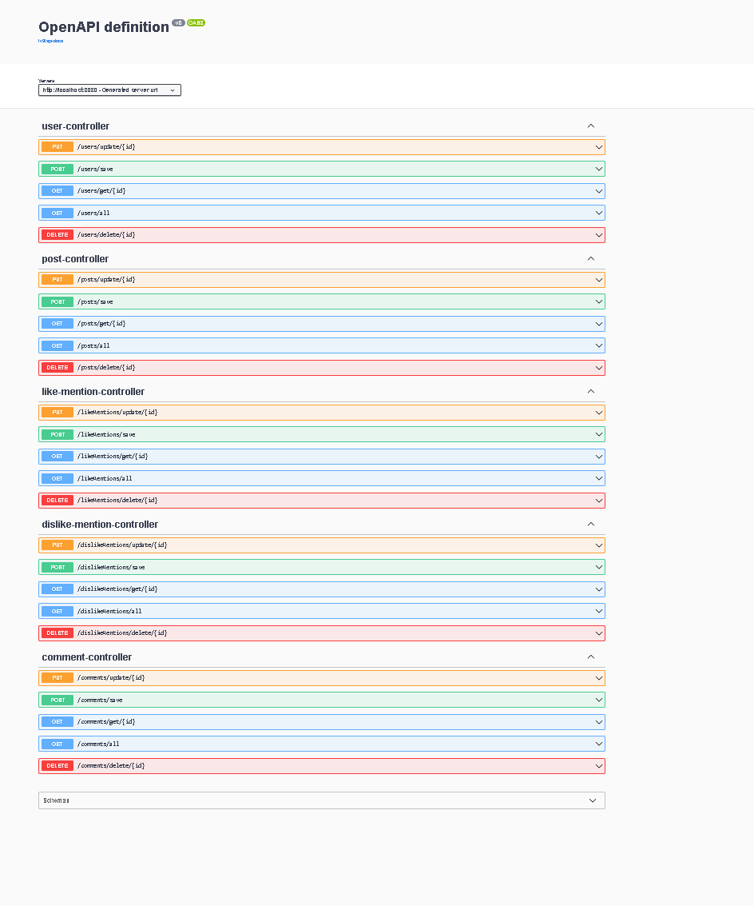

## TP Vendredi 07 Juillet 2023

Vous allez créer une API qui va vous permettre de créer une application de gestion des Posts pour des utilisateurs.

Un User peut créer un ou plusieurs Post. Chaque Post peut être commenté plusieurs fois et chaque commentaire peut être liké et dislike plusieurs fois.

• Un User sera composé d’un id, userName et d’un password.

• Un Post sera composé d’un id, d’un 8tre et d’un texte.

• Un commentaire sera composé d’un Id et d’un message.

• Un like d’un id et d’une date.

• Un dislike d’un id et d’une date.

Si on supprime un User, le ou les post seront toujours existants.

Par contre, si on supprime un post, on perd les commentaires, ainsi que les likes et les dislike.

Il faudra créer un CRUD complet pour chacune des entités.

Le descriptif ci-dessus des classes ne prend pas en compte, les relations entre les entity. 
Il faudra faire en sorte qu’elles apparaissent dans votre bdd et dans vos entités.

Pour les DTO :

Un DTO simple pour l’ensemble des entités (likeDto, dislikeDto, commentaireDto et PostDto).

Pour User, on ne souhaitera pas récupérer son mot de passe, lorsqu’on voudra afficher la liste des user ou d’un user.

Pour les contraintes de validation :

- User : userName => Not Null + longueur max 15.
- User : password => Not Null + longueur max 8, 1 caractère spécial, 1 majuscule, 1 minuscule et 2 nombres.
- La combinaison username et password doit être unique en bdd.
- Post : 8tre => Not Null + longueur min 4 et max 15 + texte max 250 caractères.
- Commentaire : message => Not Null + 500 caractères.
- Like : date => format : «dd-MM-yyyy ».
- DisLike : date => format : «dd-MM-yyyy ».

  - Si une des contraintes de validation est levée, cela génèrera une exception de type BAD_REQUEST.
  A traiter dans une classe à part.
  
  - Les contraintes seront portées sur les DTO.

Pour les exceptions :
Il faudra traiter les « Not Found » Exception pour chacune des opérations de recherche d’une entité dans votre application.

Chacune de vos réponses dans vos controllers devront retourner un code status (ex : BAD_REQUEST, 400).

Un code status spécifique dans le cas ou lors de la création d’un user, la combinaison username et password existe déjà.

Vous pouvez traiter d’autres types d’exception que vous jugerez nécessaire. 

Mettez en place Swagger pour votre API pour sa documenta8on.

